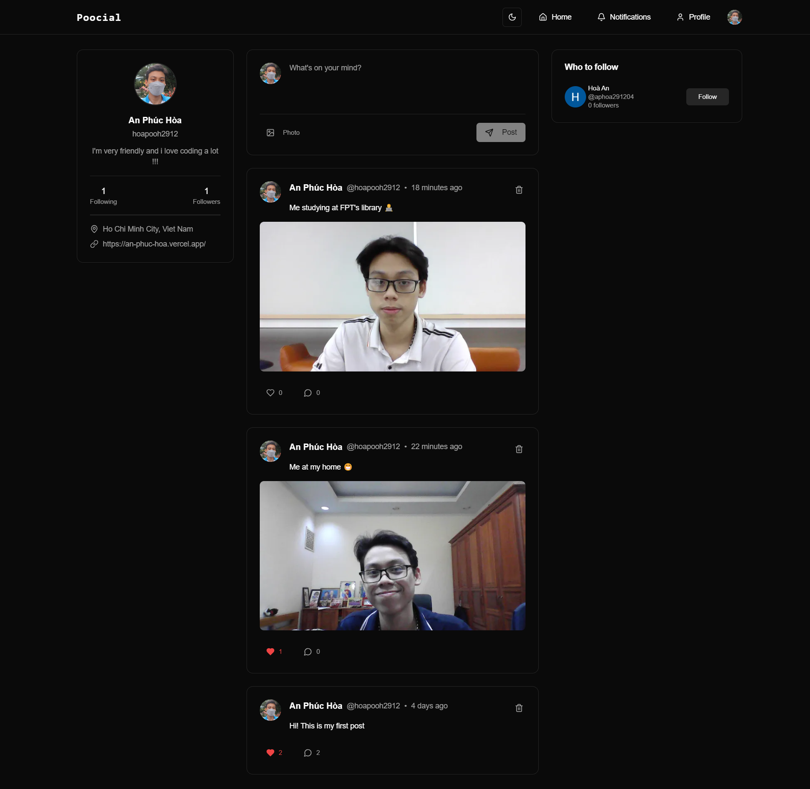
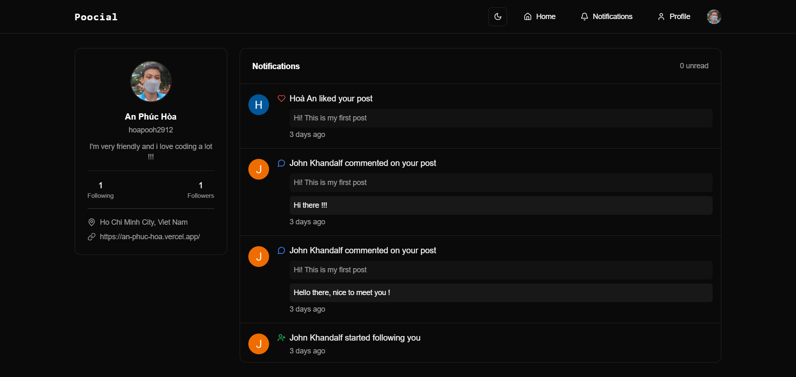

# ✨ Poocial -- Online Social Media ✨
Credit: [As A Programmer](https://www.youtube.com/@asaprogrammer_)

## Preview
**Homepage**



**Notifications**


**Profile**


## Tech Stack


- [uploadthing](https://uploadthing.com/) for image uploading.

## How to run my project
1. Clone this github repository
```bash
git clone https://github.com/hoapooh/poocial.git
```

2. Install dependencies
```bash
npm install
# or
yarn install
# or
pnpm install
# or
bun install
```

3. Run project
```bash
npm run dev
# or
yarn dev
# or
pnpm dev
# or
bun dev
```
Open [http://localhost:3000](http://localhost:3000) with your browser to see the result.

You can start editing the page by modifying `app/page.tsx`. The page auto-updates as you edit the file.

## Deploy on Vercel

The easiest way to deploy your Next.js app is to use the [Vercel Platform](https://vercel.com/new?utm_medium=default-template&filter=next.js&utm_source=create-next-app&utm_campaign=create-next-app-readme) from the creators of Next.js.

Check out our [Next.js deployment documentation](https://nextjs.org/docs/app/building-your-application/deploying) for more details.
